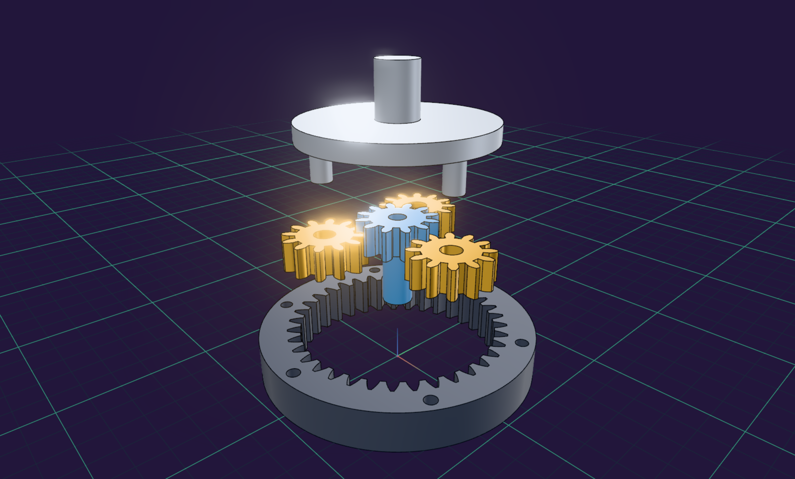

<p align="center">
  
</p>

# FundaCAD

Free, open source parametric CAD for 3D printing. Sketch it, constrain it, model
it, and export STEP, STL or 3MF. Windows, macOS and Linux.

<p align="center">
  <a href="https://github.com/Paraxdev/fundacad/releases/tag/beta"></a>
  <a href="LICENSE"></a>
  
</p>

**[Download FundaCAD](https://github.com/Paraxdev/fundacad/releases/tag/beta)**, a
portable Windows exe, a macOS app, and a Flatpak, AppImage, `.deb` and `.rpm` for
Linux. No account, no cloud, no subscription, your files stay on your disk.

Built on the Open CASCADE geometry kernel through the Funda Engine (Rust),
with a [Tauri](https://tauri.app) shell and a Vue + three.js viewport. A part
is a timeline of features, so you can go back to any one of them, change it,
and the model rebuilds from there.


It started as a fork of [SindriCAD](https://github.com/MakerViking/sindricad) and
has diverged quite a lot since, mainly UI and a rust backend 
under the same AGPL-3.0 licence.


## Disclosure  
This project heavily or exclusively uses AI to generate code and tests.
do NOT expect this software to be enterprise grade but it does allow very fast iteration.
you may use AI for feature requests or even forking and creating your own.
this code open to the public and free forever.

human input is made for decisions, guiding and real usage by me.
the goal is it to make this a personalized version of a CAD with features I like and would love to have.


<p align="center">
  
</p>

<p align="center">
  
</p>

<p align="center">
  
</p>

<p align="center">
  
</p>

## Features

- **Parametric modelling with a feature history.** Extrude, revolve, loft,
  sweep, fillet, chamfer, shell, draft, holes, threads, mirror, patterns,
  split and booleans. Scrub back to any step, change it, and the part rebuilds.
- **Constrained 2D sketches**, on a plane, a datum plane or the face of a body,
  that follow that face when the model changes.
- **Parameters** that drive dimensions, with sliders, groups and named
  configurations through the Extra Parameters plugin.
- **Made for 3D printing.** Export STL, 3MF and STEP, print-friendly hole
  shapes and edge finishes that need no supports, real surface textures
  (knurl, hex, voronoi, heightmaps), multi-material filament slots, a bed fit
  check, and sending jobs to a printer on your network.
- **Import STEP**, including large coloured assemblies, and keep working on them.
- **A fastener library** of standard screws, nuts and washers to drop onto a face.
- **3D mouse (SpaceMouse) and game controller** support, a Steam Deck included.
- **AI assistants over MCP.** Claude or any MCP host can build, measure and edit
  the model you have open.
- **Plugins** for everything optional, each one asking for only what it needs.
- **Themes**, dark, light, Dracula, Solarized, Noir tints and a colour-blind
  safe one.
- **Open file formats**, readable `.funda` JSON or the compact `.fundab`.

## Install

Prebuilt installers for Windows, macOS (Apple Silicon) and Linux are on the
[beta release](https://github.com/Paraxdev/fundacad/releases/tag/beta),
FundaCAD 1.0 on the Funda Engine, rebuilt from `main` on every green
build. The Python engine is retired, and its last build stays on the
[legacy-final release](https://github.com/Paraxdev/fundacad/releases/tag/legacy-final).
Files open in both. These builds do not update themselves yet, so come back to
the beta page for a newer one.

To let an AI assistant (Claude Code, Claude Desktop or any MCP host) build and
edit models in the app, open **Preferences, AI assistants (MCP)**: the MCP
server ships with the app, and that section gives the setup to paste.

On Windows, `fundacad.exe` is a portable single contained exe. you may use it from anywhere, you just need WebView2 installed. win11 comes with it shipped and win10 includes it with newer updates.
The builds are **not code signed**, so each OS says so in its own way:

- **Windows**, SmartScreen shows "Windows protected your PC". Choose **More
  info**, then **Run anyway**. The portable build says it too, on first run.
- **macOS**, Gatekeeper may report the app as damaged. It is not; that is what
  an unsigned app looks like to a current macOS. Clear the quarantine flag once,
  after moving it to Applications:
  ```bash
  xattr -dr com.apple.quarantine /Applications/FundaCAD.app
  ```
- **Linux**, the Flatpak runs everywhere, NixOS, Fedora Silverblue and
  SteamOS included, because its runtime carries WebKitGTK and GTK. Install it
  from the downloaded file:

  ```bash
  flatpak install --user ./FundaCAD_1.0.217_x86_64.flatpak
  flatpak run dev.fundacad.app
  ```

  It is sandboxed with access to your home folder. A SpaceMouse still needs
  the udev rule from `packaging/99-spacemouse.rules` on the host.

  The AppImage needs `chmod +x` and WebKitGTK 4.1 from your distribution. It
  does not carry its own, because the bundled one left a blank window on
  current systems; when it is missing, the AppImage says so and prints the
  command that installs it.

  The `.deb` and `.rpm` are built on Ubuntu 22.04, so they depend on the
  WebKitGTK that ships from there on: `libwebkit2gtk-4.1-0`. That means
  **Ubuntu 22.04 or newer, or Debian 12 or newer**. Install the `.deb` with apt
  and not with `dpkg -i`, because dpkg only *reports* a missing dependency
  while apt goes and fetches it:

  ```bash
  sudo apt install ./FundaCAD_1.0.217_amd64.deb
  ```

  Distributions carrying only the older `libwebkit2gtk-4.0-37`, or only the
  newer `libwebkitgtk-6.0-4`, cannot satisfy that dependency under the name the
  package asks for, and there the Flatpak is the answer.

## Build

Needs [Node](https://nodejs.org), [Rust](https://rustup.rs), cmake and a C++
toolchain: the Funda Engine compiles OpenCASCADE from source on the first
build, about twenty minutes, then it is cached (docs/PACKAGING.md). On Windows
use the MSVC toolchain.

```bash
git clone https://github.com/Paraxdev/fundacad.git
cd fundacad
npm install
```

Then:

```bash
npm run tauri dev      # run it, starts vite and the engine for you
npm run tauri build    # package a desktop build
npm test               # vitest
cargo test --workspace --features fundacad-engine/ws   # the engine
```

### Frontend only

Two terminals, if you are iterating on the UI in a browser:

```bash
cargo run --bin fundacad-engine -- --ws   # ws://127.0.0.1:8765
npm run dev                               # http://localhost:5173
```

The engine prints `TOKEN <t>` on its first line and refuses connections without
it, so open `http://localhost:5173/?token=<t>`. Without it the viewport connects,
is refused, and silently never builds anything. `FUNDACAD_ENGINE_TOKEN` and
`FUNDACAD_ENGINE_PORT` fix the token and the port instead.

## Docs

- [`docs/ARCHITECTURE.md`](docs/ARCHITECTURE.md), how the processes fit together
- [`docs/ENGINE.md`](docs/ENGINE.md), the Funda Engine: its target architecture, test strategy and golden files, the beta rolling release, and its performance work
- [`docs/PROTOCOL.md`](docs/PROTOCOL.md), the messages the frontend and the engine exchange
- [`docs/FUNDA-FORMAT.md`](docs/FUNDA-FORMAT.md), the readable `.funda` JSON document and the self-repairing binary `.fundab`
- [`docs/PACKAGING.md`](docs/PACKAGING.md), how a desktop bundle is built
- [`docs/MCP.md`](docs/MCP.md), MCP, built into the app: how an AI assistant builds, measures and looks at parts, and how to connect one
- [`docs/PLUGINS.md`](docs/PLUGINS.md), optional parts of the app, what they may reach, and how that is asked
