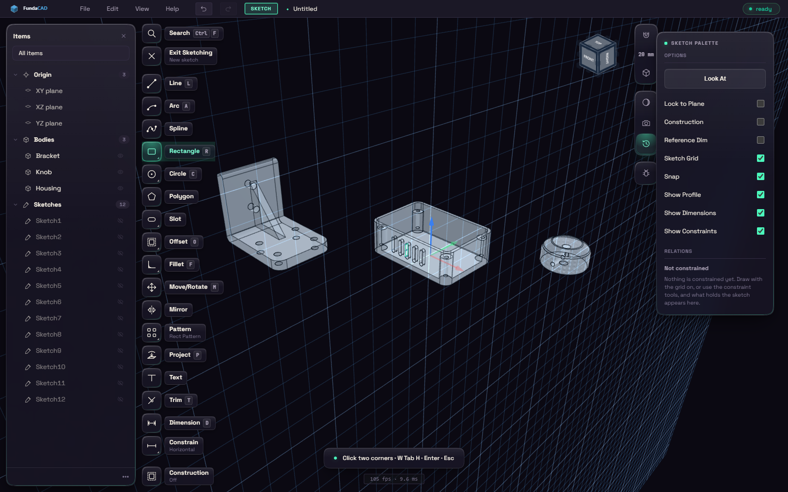
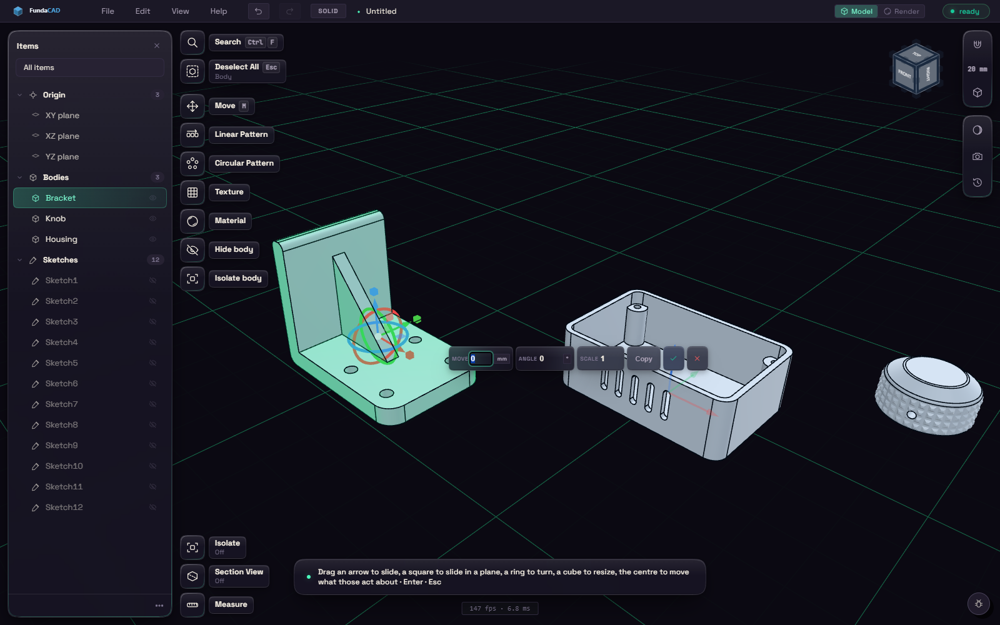
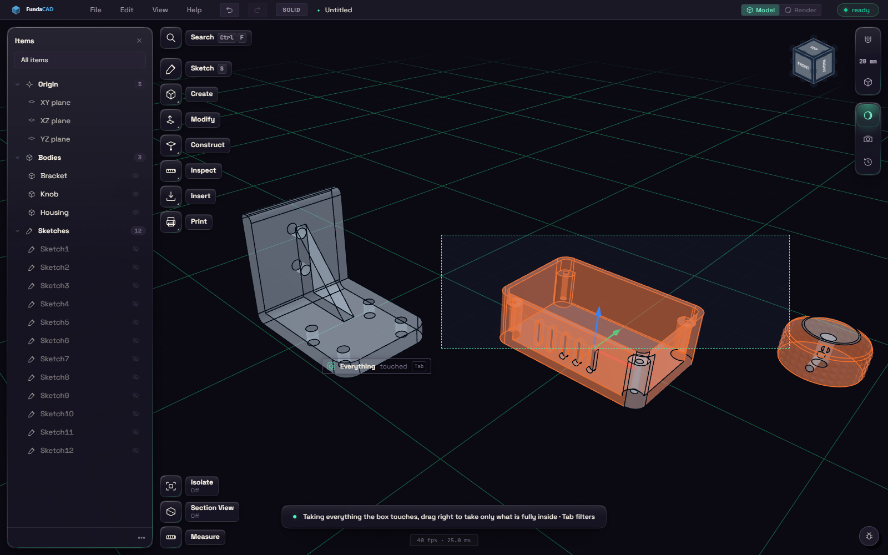

# FundaCAD

> [!WARNING]
> **This branch is no longer updated.** The Python geometry engine is retired,
> and `legacy` is kept only as a record of it. FundaCAD continues on the Rust
> engine, built from [`main`](https://github.com/Paraxdev/fundacad/tree/main)
> and published as the
> [rolling beta](https://github.com/Paraxdev/fundacad/releases/tag/beta),
> which is the only FundaCAD release.

Free, open source parametric CAD for 3D printing. Sketch it, constrain it, model
it, and export STEP, STL or 3MF. Windows, macOS and Linux.

Built on the Open CASCADE geometry kernel through
[build123d](https://github.com/gumyr/build123d), with a Rust
([Tauri](https://tauri.app)) shell and a Vue + three.js viewport. A part is a
timeline of features, so you can go back to any one of them, change it, and the
model rebuilds from there.


It started as a fork of [SindriCAD](https://github.com/MakerViking/sindricad) and
has diverged quite a lot since, under the same AGPL-3.0 licence.


## Disclosure  
This project heavily or exclusively uses AI to generate code and tests.
do NOT expect this software to be enterprise grade but it does allow very fast iteration.
you may use AI for feature requests or even forking and creating your own.
this code open to the public and free forever.

human input is made for decisions, guiding and real usage by me.
the goal is it to make this a personalized version of a CAD with features I like and would love to have.


<p align="center">
  
</p>

<p align="center">
  
</p>

<p align="center">
  
</p>


<p align="center">
  
</p>

## Install

This branch has no installers any more. Every FundaCAD build is on the
[beta release](https://github.com/Paraxdev/fundacad/releases/tag/beta), the
Rust engine built from `main`, and the Python engine documents open there.

## Build

Needs [Node](https://nodejs.org), [Rust](https://rustup.rs) (for the Tauri
shell), and [uv](https://docs.astral.sh/uv) (which fetches Python for you).

```bash
git clone https://github.com/Paraxdev/fundacad.git
cd fundacad
npm install
(cd sidecar && uv sync)
```

Then:

```bash
npm run tauri dev      # run it, starts vite and the sidecar for you
npm run tauri build    # package a desktop build
npm test               # vitest
```

### Frontend only

Two terminals, if you are iterating on the UI and don't need a Rust rebuild:

```bash
cd sidecar && uv run python server.py   # ws://127.0.0.1:8765
npm run dev                             # http://localhost:5173
```

The sidecar prints `TOKEN <t>` on its first line and refuses connections without
it, so open `http://localhost:5173/?token=<t>`. Without it the viewport connects,
is refused, and silently never builds anything. A sidecar started this way also
outlives its shell, so kill it by hand or it keeps port 8765.

## Docs

- [`docs/ARCHITECTURE.md`](docs/ARCHITECTURE.md), how the three processes fit together
- [`docs/PROTOCOL.md`](docs/PROTOCOL.md), the WebSocket the frontend and sidecar speak
- [`docs/FUNDA-FORMAT.md`](docs/FUNDA-FORMAT.md), the readable `.funda` JSON document and the self-repairing binary `.fundab`
- [`docs/PACKAGING.md`](docs/PACKAGING.md), how the bundled Python runtime is built
- [`docs/MCP.md`](docs/MCP.md), the MCP server another model builds, measures and looks at parts through
- [`docs/PLUGINS.md`](docs/PLUGINS.md), optional parts of the app, what they may reach, and how that is asked
- [`docs/EDGE-CASES.md`](docs/EDGE-CASES.md) / [`docs/IMPROVEMENT-AUDIT.md`](docs/IMPROVEMENT-AUDIT.md), known rough edges
