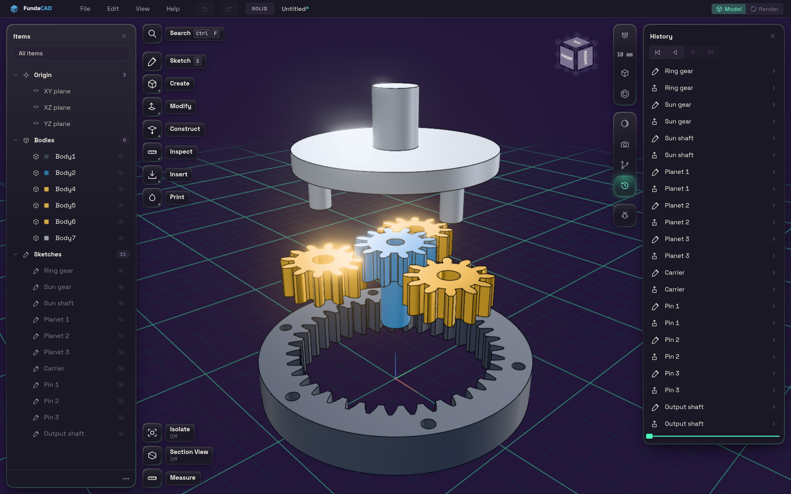
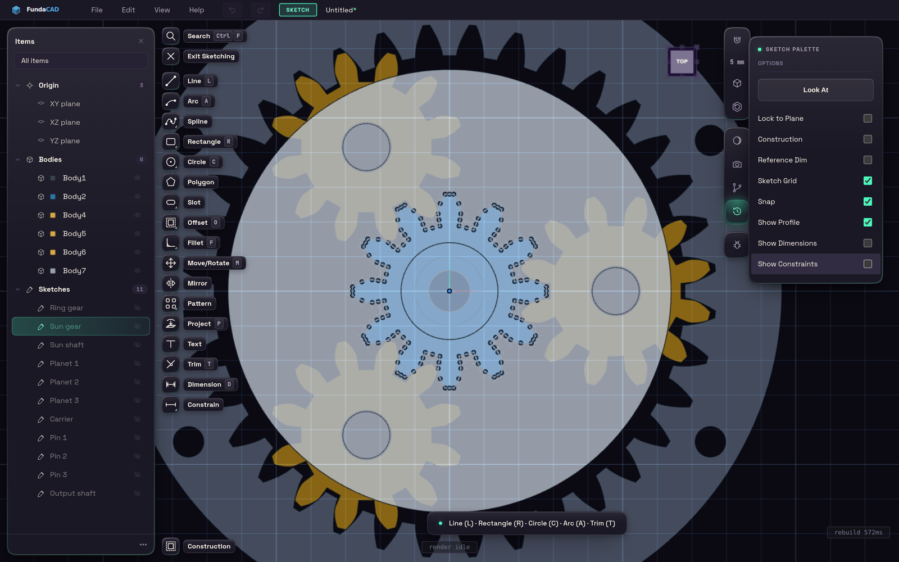
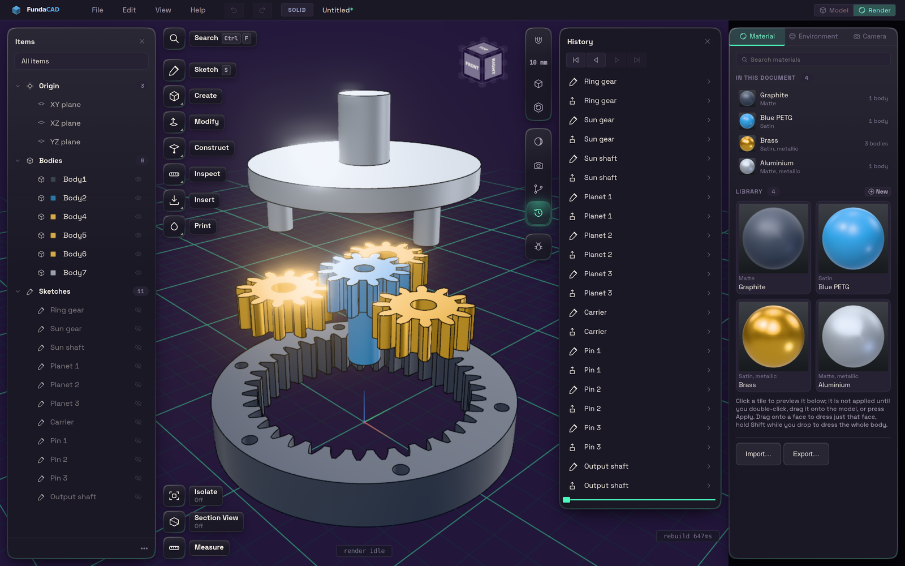

<p align="center">
  
</p>

# FundaCAD

Free, open source parametric CAD for 3D printing. Sketch it, constrain it, model
it, and export STEP, STL or 3MF. Windows, macOS and Linux.

<p align="center">
  <a href="https://github.com/Paraxdev/fundacad/releases/tag/beta"></a>
  <a href="LICENSE"></a>
  
</p>

**[Download FundaCAD](https://github.com/Paraxdev/fundacad/releases/tag/beta)**, a
portable Windows exe, a macOS app, and a Flatpak, AppImage, `.deb` and `.rpm` for
Linux. No account, no cloud, no subscription, your files stay on your disk.

Built on the Open CASCADE geometry kernel through the Funda Engine (Rust),
with a [Tauri](https://tauri.app) shell and a Vue + three.js viewport. A part
is a timeline of features, so you can go back to any one of them, change it,
and the model rebuilds from there.


It started as a fork of [SindriCAD](https://github.com/MakerViking/sindricad) and
has diverged quite a lot since, mainly UI and a rust backend 
under the same AGPL-3.0 licence.


## Disclosure  
This project heavily or exclusively uses AI to generate code and tests.
do NOT expect this software to be enterprise grade but it does allow very fast iteration.
you may use AI for feature requests or even forking and creating your own.
this code open to the public and free forever.

human input is made for decisions, guiding and real usage by me.
the goal is it to make this a personalized version of a CAD with features I like and would love to have.


<p align="center">
  
</p>

<p align="center">
  
</p>

<p align="center">
  
</p>

## Features

- **Parametric modelling with a feature history.** Extrude, revolve, loft,
  sweep, fillet, chamfer, shell, draft, holes, threads, mirror, patterns,
  split and booleans. Scrub back to any step, change it, and the part rebuilds.
- **Constrained 2D sketches**, on a plane, a datum plane or the face of a body,
  that follow that face when the model changes.
- **Parameters** that drive dimensions, with sliders, groups and named
  configurations through the Extra Parameters plugin.
- **Made for 3D printing.** Export STL, 3MF and STEP, print-friendly hole
  shapes and edge finishes that need no supports, real surface textures
  (knurl, hex, voronoi, heightmaps), multi-material filament slots, a bed fit
  check, and sending jobs to a printer on your network.
- **Import STEP**, including large coloured assemblies, and keep working on them.
- **A fastener library** of standard screws, nuts and washers to drop onto a face.
- **3D mouse (SpaceMouse) and game controller** support, a Steam Deck included.
- **AI assistants over MCP.** Claude or any MCP host can build, measure and edit
  the model you have open.
- **Plugins** for everything optional, each one asking for only what it needs.
- **Themes**, dark, light, Dracula, Solarized, Noir tints and a colour-blind
  safe one.
- **Open file formats**, readable `.funda` JSON or the compact `.fundab`.

## Install

Prebuilt installers for Windows, macOS (Apple Silicon) and Linux are on the
[beta release](https://github.com/Paraxdev/fundacad/releases/tag/beta),
FundaCAD 1.0 on the Funda Engine, rebuilt from `main` on every green
build. The Python engine is retired, and its last build stays on the
[legacy-final release](https://github.com/Paraxdev/fundacad/releases/tag/legacy-final).
Files open in both. These builds do not update themselves yet, so come back to
the beta page for a newer one.

To let an AI assistant (Claude Code, Claude Desktop or any MCP host) build and
edit models in the app, open **Preferences, AI assistants (MCP)**: the MCP
server ships with the app, and that section gives the setup to paste.

On Windows, `fundacad.exe` is a portable single contained exe. you may use it from anywhere, you just need WebView2 installed. win11 comes with it shipped and win10 includes it with newer updates.
The builds are **not code signed**, so each OS says so in its own way:

- **Windows**, SmartScreen shows "Windows protected your PC". Choose **More
  info**, then **Run anyway**. The portable build says it too, on first run.
- **macOS**, Gatekeeper may report the app as damaged. It is not; that is what
  an unsigned app looks like to a current macOS. Clear the quarantine flag once,
  after moving it to Applications:
  ```bash
  xattr -dr com.apple.quarantine /Applications/FundaCAD.app
  ```
- **Linux**, the Flatpak runs everywhere, NixOS, Fedora Silverblue and
  SteamOS included, because its runtime carries WebKitGTK and GTK. Install it
  from the downloaded file:

  ```bash
  flatpak install --user ./FundaCAD-linux-x86_64.flatpak
  flatpak run dev.fundacad.app
  ```

  It is sandboxed with access to your home folder. A SpaceMouse still needs
  the udev rule from `packaging/99-spacemouse.rules` on the host.

  The AppImage needs `chmod +x` and WebKitGTK 4.1 from your distribution. It
  does not carry its own, because the bundled one left a blank window on
  current systems; when it is missing, the AppImage says so and prints the
  command that installs it.

  The `.deb` and `.rpm` are built on Ubuntu 22.04, so they depend on the
  WebKitGTK that ships from there on: `libwebkit2gtk-4.1-0`. That means
  **Ubuntu 22.04 or newer, or Debian 12 or newer**. Install the `.deb` with apt
  and not with `dpkg -i`, because dpkg only *reports* a missing dependency
  while apt goes and fetches it:

  ```bash
  sudo apt install ./FundaCAD-linux-x86_64.deb
  ```

  Distributions carrying only the older `libwebkit2gtk-4.0-37`, or only the
  newer `libwebkitgtk-6.0-4`, cannot satisfy that dependency under the name the
  package asks for, and there the Flatpak is the answer.

## Run it from source

FundaCAD is a Vue frontend in a [Tauri](https://tauri.app) window, with the
Funda Engine (Rust) and the OpenCASCADE geometry kernel (C++) compiled into one
executable. Running it from a checkout takes a handful of tools, one clone and
one command. The very first build also compiles OpenCASCADE itself, which takes
about twenty minutes; every build after that reuses it.

### 1. Install the tools

**Windows** (10 or 11, x64):

1. **Node.js 22 LTS or newer** from [nodejs.org](https://nodejs.org), the LTS
   installer with its defaults.
2. **Visual Studio 2022 Build Tools** from
   [visualstudio.microsoft.com/visual-cpp-build-tools](https://visualstudio.microsoft.com/visual-cpp-build-tools/).
   In the installer tick the **Desktop development with C++** workload and
   install. It brings the MSVC compiler and the Windows SDK. Visual Studio 2022
   Community with the same workload works too.
3. **CMake 3.22 or newer** from [cmake.org/download](https://cmake.org/download/),
   the Windows x64 installer, and let it add CMake to the PATH. CMake 4 is fine.
4. **Rust 1.89 or newer** through [rustup](https://rustup.rs): run
   `rustup-init.exe` and take the defaults, which install the stable toolchain
   for `x86_64-pc-windows-msvc`. Install it after the Build Tools. If rustup
   is already installed, run `rustup update` to get a current toolchain.
5. **Git** from [git-scm.com](https://git-scm.com).

The WebView2 runtime the window draws with is already part of Windows 10 and
11. If it was removed, get the Evergreen runtime from
[Microsoft](https://developer.microsoft.com/microsoft-edge/webview2/).

Open a **new** terminal so it sees the new PATH, and check:

```powershell
node --version     # v22 or newer
cmake --version    # 3.22 or newer
rustup show        # the active toolchain ends in -pc-windows-msvc, 1.89 or newer
where.exe cargo    # the FIRST line is in C:\Users\<you>\.cargo\bin
```

If `where.exe cargo` lists another cargo first, or `rustup` is not
recognized, see [Troubleshooting](#troubleshooting) before going on.

Clone into a short path such as `C:\src\fundacad`. The OpenCASCADE build nests
deep folders inside the checkout, and a long base path runs into Windows' 260
character path limit (see Troubleshooting).

**Linux** (Debian or Ubuntu 22.04 and newer; other distributions need the same
packages under their own names, see
[Tauri's prerequisites](https://v2.tauri.app/start/prerequisites/)). The
package list is the one CI installs, from
[`.github/actions/linux-deps/action.yml`](.github/actions/linux-deps/action.yml),
which is the source of truth, plus cmake:

```bash
sudo apt-get update
sudo apt-get install -y libwebkit2gtk-4.1-dev build-essential curl wget file \
  libssl-dev libgtk-3-dev libayatana-appindicator3-dev librsvg2-dev \
  libudev-dev patchelf libfuse2 cmake
curl --proto '=https' --tlsv1.2 -sSf https://sh.rustup.rs | sh
```

plus Node.js 22 or newer from [nodejs.org](https://nodejs.org) or your package
manager.

**macOS**:

```bash
xcode-select --install
brew install cmake node
curl --proto '=https' --tlsv1.2 -sSf https://sh.rustup.rs | sh
```

### 2. Run it

```bash
git clone https://github.com/Paraxdev/fundacad.git
cd fundacad
npm install
npm run tauri dev
```

`npm run tauri dev` starts the Vite dev server, compiles the app and opens the
window. Frontend edits show up live; a Rust edit recompiles and restarts the
app.

**The first build takes about twenty minutes**, longer on a laptop. Most of it
is spent in OpenCASCADE, a large C++ library that is compiled from source and
linked statically, so the app needs no OpenCASCADE installed on any machine it
runs on. Cargo sits on `Building [...] opencascade-sys(build)` meanwhile, that
is normal. The kernel lands in `target/OCCT` at the top of the checkout and is
shared by the app and the engine workspace, so it is compiled once per
checkout. Running `cargo clean` in the top folder deletes it, and the next
build compiles it again. Another checkout or worktree can reuse it by setting
the `FUNDACAD_OCCT_ROOT` environment variable to the **absolute** path of that
`target/OCCT`, for example `C:\src\fundacad\target\OCCT`. The details are in
[docs/PACKAGING.md](docs/PACKAGING.md#the-opencascade-kernel).

Builds from before this layout put the kernel in `src-tauri/target/OCCT`
instead. Nothing reads that folder any more, so it can be deleted to free about
a gigabyte.

### 3. Build an installer

```bash
npm run tauri build
```

The installers land in `src-tauri/target/release/bundle/`: an `.msi` and an
NSIS `-setup.exe` on Windows (Tauri downloads WiX and NSIS the first time), a
`.dmg` and `.app` on macOS, an AppImage, `.deb` and `.rpm` on Linux. The bare
executable is `src-tauri/target/release/fundacad.exe` on Windows. The release
build compiles the Rust again with optimisations but reuses the kernel.

### 4. Run the tests

```bash
npm test                 # frontend unit tests (vitest)
npm run typecheck        # vue-tsc
cargo test --workspace --features fundacad-engine/ws   # the engine, from the top folder
cd src-tauri && cargo test --tests                     # the app shell, needs the dist/ that npm run build makes
```

### Frontend only

Two terminals, if you are iterating on the UI in a browser:

```bash
cargo run --bin fundacad-engine -- --ws   # ws://127.0.0.1:8765
npm run dev                               # http://localhost:5173
```

The engine prints `TOKEN <t>` on its first line and refuses connections without
it, so open `http://localhost:5173/?token=<t>`. Without it the viewport connects,
is refused, and silently never builds anything. `FUNDACAD_ENGINE_TOKEN` and
`FUNDACAD_ENGINE_PORT` fix the token and the port instead.

### Troubleshooting

- **`FundaCAD's kernel crashes when built with the MinGW (windows-gnu)
  toolchain`**, or cmake output mentioning `MinGW Makefiles`. The cargo that
  ran targets `windows-gnu` instead of `windows-msvc`. Either rustup's default
  toolchain is the GNU one, or a second Rust install (from a package manager,
  MSYS2 or similar) comes before rustup on the PATH.
  1. Run `rustup show`. If the default toolchain ends in `-windows-gnu`, run
     `rustup default stable-x86_64-pc-windows-msvc`.
  2. Run `where.exe cargo`. If the first line is not in
     `C:\Users\<you>\.cargo\bin`, another Rust is ahead of rustup. Uninstall it,
     or move `%USERPROFILE%\.cargo\bin` above it in the PATH, then open a new
     terminal. Windows reads the System Path before the User Path, so a Rust in
     the System Path needs `.cargo\bin` moved there too. To try a build without
     changing anything, put rustup first for the current PowerShell only:

     ```powershell
     $env:PATH = "$HOME\.cargo\bin;$env:PATH"
     npm run tauri dev
     ```
- **`rustup` is not recognized**, or `where.exe cargo` lists nothing in
  `C:\Users\<you>\.cargo\bin`. rustup is either not installed or its folder is
  not on the PATH. If `C:\Users\<you>\.cargo\bin\rustup.exe` exists, add that
  folder to the User Path as above and open a new terminal; otherwise install
  rustup (step 1).
- **`exceeds the OS max path limit`** or another MSBuild error about a path
  being too long. The checkout sits too deep for the nested OpenCASCADE build
  folders. Clone it again into a short path such as `C:\src\fundacad`.
- **`use of unstable library feature`** inside `opencascade-sys`'s build
  script, or cargo saying the package requires a newer rustc. The toolchain is
  older than 1.89; run `rustup update`.
- **`include could not find requested file: .../OpenCASCADEFoundationClassesTargets.cmake`**
  followed by `Builtin OpenCASCADE library not found`. Older builds registered
  their OpenCASCADE build folders in CMake's package registry, and CMake picked
  a broken one from there. The current build ignores that registry, so pull
  the latest `main`. On an older branch, clear the registry entries, which only
  ever point at build folders:

  ```powershell
  reg delete HKCU\Software\Kitware\CMake\Packages\OpenCASCADE /f
  ```

  On Linux and macOS: `rm -rf ~/.cmake/packages/OpenCASCADE`. On the current
  `main` those entries are harmless and can stay.
- **`This directory holds an OpenCASCADE kernel built by MinGW or GCC`** (or
  `by MSVC`, or `built for <another target>`). A kernel from the other Windows
  toolchain, or for another target, is in the folder the message names, often
  left by a build with the wrong cargo. Delete that folder and build again;
  the kernel is rebuilt there.
- **`FUNDACAD_OCCT_ROOT holds no OpenCASCADE install`** or **`FUNDACAD_OCCT_ROOT
  has to be an absolute path`**. That environment variable points somewhere
  without a kernel, or is relative. Remove it to use the checkout's own
  `target/OCCT`, or set it to the absolute path of a folder that has one.
- **`Compatibility with CMake < 3.5 has been removed from CMake`**. CMake 4
  refuses the minimum OpenCASCADE 7.8.1 declares. The checkout's
  `.cargo/config.toml` sets `CMAKE_POLICY_VERSION_MINIMUM=3.5`, which cargo
  only reads when run inside the checkout; set that environment variable when
  building from elsewhere.
- **`could not find any instance of Visual Studio`**. The Build Tools are
  missing the **Desktop development with C++** workload; add it from the
  Visual Studio Installer.

## Docs

- [`docs/ARCHITECTURE.md`](docs/ARCHITECTURE.md), how the processes fit together
- [`docs/ENGINE.md`](docs/ENGINE.md), the Funda Engine: its target architecture, test strategy and golden files, the beta rolling release, and its performance work
- [`docs/PROTOCOL.md`](docs/PROTOCOL.md), the messages the frontend and the engine exchange
- [`docs/FUNDA-FORMAT.md`](docs/FUNDA-FORMAT.md), the readable `.funda` JSON document and the self-repairing binary `.fundab`
- [`docs/PACKAGING.md`](docs/PACKAGING.md), how a desktop bundle is built
- [`docs/MCP.md`](docs/MCP.md), MCP, built into the app: how an AI assistant builds, measures and looks at parts, and how to connect one
- [`docs/PLUGINS.md`](docs/PLUGINS.md), optional parts of the app, what they may reach, and how that is asked
